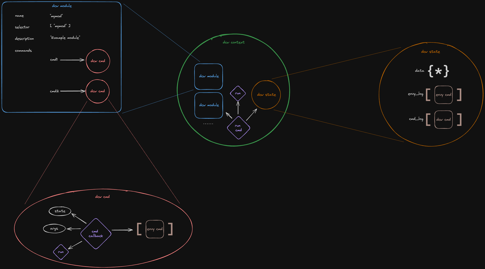
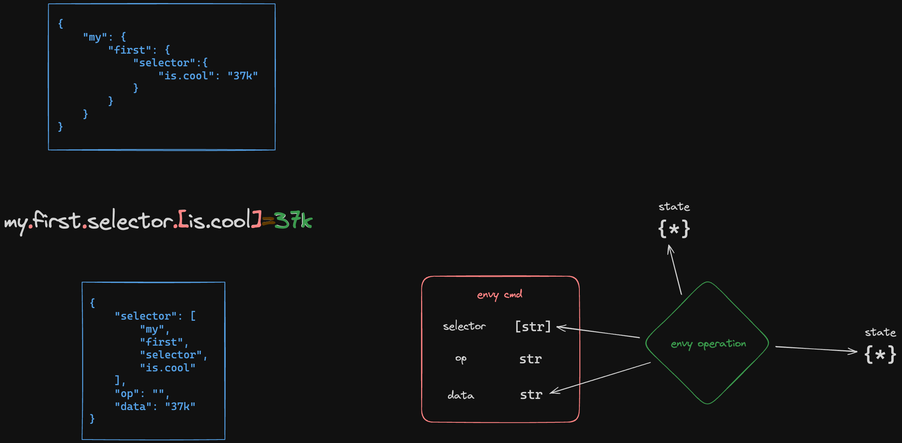

# DCW (Development Configuration Wrapper)

_DCW is a wish for DCW to become a wrapper around development tooling_

## Table of contents

- [DCW (Development Configuration Wrapper)](#dcw-development-configuration-wrapper)
  - [Table of contents](#table-of-contents)
  - [Core](#core)
    - [Context](#context)
    - [Envy](#envy)
    - [State](#state)
    - [Modules](#modules)
    - [Commands](#commands)
  - [Standard dcw library](#standard-dcw-library)
  - [Cli](#cli)
  - [Feature List](#feature-list)
  - [Development](#development)

## Core

DCW is modular system for wrapping development tools. It comes with standard library of modules.

Dcw core is composed of:

-   Envy
-   Context
-   State
-   Modules

### Context

Dcw context holds state of the dcw application, loads and stores all dcw modules and allows running dcw module commands. 

It can be viewd as one dcw application context.

### Envy

Envy is simple scripting command language to update nested data.

Envy consists of envy commands and envy operations that handles those commands.

This is an atempt to describe it:

-   Envy command is any valid unix environment variable `env_name=env_value`. This can be any pair of strings `(str, str)` that represents env name and value
-   `env_value` - is a string value processed by envy operation
-   `env_name` is interpreted in the following way (regex operations used: `(),|,*`)
    -   expression: `([SEL] | SEL)(.[SEL] | .SEL)*(OP)`
    -   tokens:
        -   `OP` - specifies operation that's used for interpretating and processing the `env_value` and the `selector` in nested object context
        -   `.` - nested object field accessor
        -   `SEL` - simple selector that represents field name without special characters (not wrapped by `[` and `]`)
        -   `[` and `]` - flat selector that allows using `.` in the field name and regulary enclosed `[` and `]`

In the explanation picture below we have one nested JSON object with one field. Bellow we see the envy script command that represents the JSON object above, also we can see JSON representation of the envy command.

> Envy implementation in this project has a few enhancements like setting the optional command prefix. See [envy.py](./dcw/envy.py)

### State

Dcw state is updated after every run of dcw commands.

DCW state is composed of:

-   `envy_log` - Envy Command Log typed `List[EnvyCmd]`
-   `data` - Nested object typed `dict`

After every successfull command run retreived command log is applied to `data` and appended to `envy_log`

### Modules

Modules are plug and pray system for dcw. They are defined as object

### Commands

## Standard dcw library

## Cli

## Feature List

## Development
